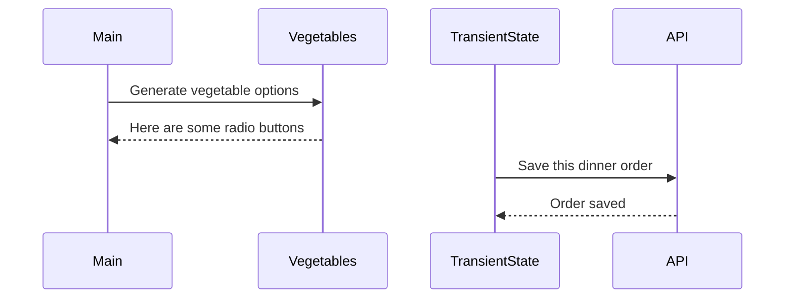

# Events and State Self-Assessment

> 🧨 Make sure you answer the vocabulary and understanding questions at the end of this document before notifying your coaches that you are done with the project

## Setup

1. Make sure you are in your `workspace` directory
1. `git clone {github repo SSH string}`
1. `cd` into the directory it creates
1. `code .` to open the project code
1. Use the `serve` command to start the web server
1. Open the URL provided in Chrome

## Requirements

### Initial Render

1. All 10 base dishes should be displayed as radio input options.
1. All 9 vegetables should be displayed as radio input options.
1. All 6 side dishes should be displayed as radio input options.
1. All previously purchases meals should be displayed below the meal options. Each purchase should display the primary key and the total cost of the purcahsed meal.

### State Management

1. When the user selects an item in any of the three columns, the choice should be stored as transient state.
1. When a user makes a choice for all three kinds of food, and then clicks the "Purchase Combo" button, a new sales object should be...
   1. Stored as permanent state in your local API.
   1. Represented as HTML below the **Monthly Sales** header in the following format **_exactly_**. Your output will not have zeroes, but the actual amount.
      ```html
      Receipt #1 = $00.00
      ```
   1. The user's choices should be cleared from transient state once the purchase is made.

## Design

Given the description and animation above...

1. Create an ERD for this application before you begin.
1. Make a list of what modules need to be created to make your application as modular as possible. Create a **Dependency Graph** for the project to be reviewed once you are complete with the assessment.
1. Create a **Sequence Diagram** that visualizes what your algorithm is for this project. We'll give you a minimal starting point.



## Vocabulary and Understanding

> 🧨 Before you click the "Assessment Complete" button on the Learning Platform, add your answers below for each question and make a commit. It is your option to request a face-to-face meeting with a coach for a vocabulary review.

1. Should transient state be represented in a database diagram? Why, or why not?

   > Not in an ERD, those are for persistent data.

2. In the **FoodTruck** module, you are **await**ing the invocataion of all of the component functions _(e.g. sales, veggie options, etc.)_. Why must you use the `await` keyword there? Explain what happens if you remove it.
   > > Note: I moved this to main.js because the additional file felt redundant (compared to how we’ve been using main.js anyway).

Since we’ve written code that awaits the invocation, it pauses the execution of the function until the Promise resolves and then returns the resolved value of the Promise (which is easier to work with and easier to read). What happened when I took await out of the Vegetables function was, when I refreshed localhost3000, nothing related to vegetables showed up on the UI and no immediate errors were thrown, but “[object Promise]” showed up where Vegetables and the options would have. Upon testing an order, the first try gave me more than 2 decimal places for receipt 4 in monthly sales, the second try gave me three of the same receipt because I pressed the button three times as I was wondering why nothing was changing immediately under monthly sales and in all 4 receipts after the first try I lost the second decimal on the total (I assume it should have been a zero). The entree and side dish prices show up in the console on dev tools before I press purchase combo button, and vegetables shows a zero - but I haven’t had a single error message. (And when you put await back in it’s place, functionality goes back to normal but now receipts 4-8 do not look like they’re supposed to in the database or the UI).

3.  When the user is making choices by selecting radio buttons, explain how that data is retained so that the **Purchase Combo** button works correctly.

> While an order is being made, the data from the radio buttons is stored in transient state and the other data for receipt number and total price are sent to and stored in permanent state when the purchase combo button is clicked.

4.  You used the `map()` array method in the self assessment _(at least, you should have since it is a learning objective)_. Explain why that function is helpful as a replacement for a `for..of` loop.
    > It’s fewer lines of code, I don’t have to push into an empty array because it creates that I want by default.
